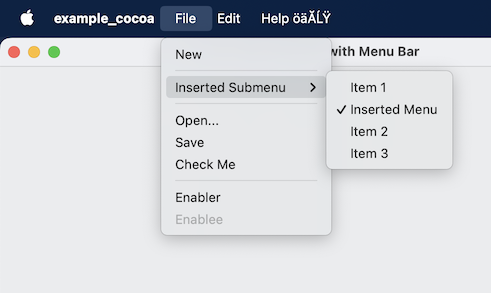
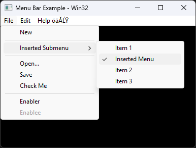

# Native Menu Bar

[](https://github.com/thomashope/native-menu-bar/actions/workflows/mac-build.yml) [](https://github.com/thomashope/native-menu-bar/actions/workflows/windows-build.yaml)

 

Native Menu Bar is a C API for adding menus to your application using native UI on Windows and Mac.

User interaction is forwarded to your application as events which can be responded to using the same code on all platforms.

Features:

* Menu bar with menus and submenus
* Clickable menu items
* Toggleable checkmark on menu items
* Enable and disable (grey out) menu items
* Only 2 files for easy integration, .h and .c
* Compiles cleanly on MSVC and clang

Please note that this library is not thread safe on any platform. You should not attempt to call any API functions from different threads at the same time.

## Building

In general you can use this library by simply adding `native_menu_bar.h` and `native_menu_bar.c` to your project.

On mac `native_menu_bar.c` should be compiled as Objective-C. You can do this by either changing the extension from `.c` to `.m`, or explicitly set it to compile as Objective-C within XCode.

Additionally on mac, Automatic Reference Counting (ARC) should be disabled for `native_menu_bar.c`. If you have ARC enabled for you project you can disable it for individual files by adding the flag `-fno-objc-arc` in _project name_ > Targets > _project name_ > Build Phases > Compile Sources.

## Building Examples

On Mac:

```sh
brew install sdl2
cd examples
./premake xcode4
open ./build/xcode4/examples.xcworkspace
```

Then select and run the example projects from within Xcode.

On Windows:

Run the following commands in Git Bash (or some other bash for windows prompt).

```sh
cd examples
./premake vs2022
start ./build/vs2022/examples.sln
```

## Contributing

Contributions are welcome. See [TODO](TODO.md) for things to work on and notes about current progress.
